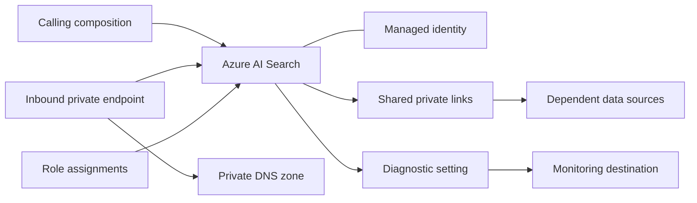

# Azure AI Search Architecture

## Scope

This module owns the Azure AI Search service and optional resources directly coupled to it. Search data-plane assets such as indexes, indexers, skillsets, data sources, and synonym maps are intentionally outside the module.

## Ownership Boundary

| Capability | Module-owned | Caller-owned |
| --- | --- | --- |
| Search service | Service, scale, hosting mode and semantic ranker setting | Indexes, indexers, skillsets, application content and release process |
| Inbound network | Private endpoint and DNS zone association | VNet, subnet, `privatelink.search.windows.net` zone and DNS forwarding |
| Outbound private dependencies | Shared private-link requests | Target resources, their firewalls and request approval |
| Identity and access | Identity attachment and configured role assignments | User-assigned identities, workload principals and application authorization |
| Monitoring | Diagnostic setting | Destination resources, queries, alerts and retention |

## Inbound Connectivity

Public network access and local API-key authentication are disabled by default. A private endpoint places a private IP in a caller-owned subnet. The associated private DNS zone maps the service hostname to that private address.

The optional public firewall scenario is intended only for constrained cases. IP allowlists do not replace identity, application authorization, transport security, and continuous monitoring.

## Shared Private Links

A shared private link lets Search reach a supported target such as Storage, Cosmos DB, SQL, or Azure AI Services without exposing that dependency publicly. Creation normally produces a pending request that an owner of the target resource must approve. Plan the approval and deployment order explicitly.

## Identity and Authorization

The service can use system-assigned and user-assigned identities. Prefer Microsoft Entra data-plane RBAC over local admin and query keys. Where indexers access dependencies, grant the Search identity only the required data-plane roles on those target resources.

## Capacity and Availability

Replicas primarily affect query availability and throughput; partitions affect storage and indexing capacity. The correct combination is workload- and SKU-specific and has a direct cost impact. Validate current regional SKU limits and SLA requirements before production deployment.

## Operations

- Monitor throttling, latency, indexing failures, storage utilization, and replica/partition saturation.
- Validate private DNS and target shared-private-link approvals after deployment.
- Treat index schema and indexer changes as application releases outside this account module.
- Do not log sensitive key or query-key outputs.
