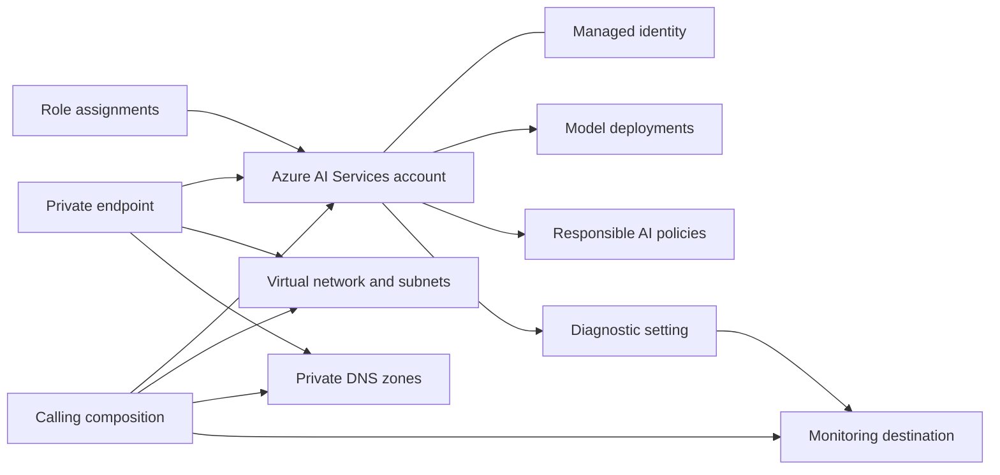

# Azure AI Services Architecture

## Scope

This module owns the Azure AI Services account and the optional resources directly coupled to that account. It does not own enterprise networking, DNS zones, identities, Key Vault keys, storage accounts, monitoring destinations, or application data.

## Ownership Boundary

| Capability | Module-owned | Caller-owned |
| --- | --- | --- |
| Service | Cognitive account, deployments, responsible AI policies | Quota, model approval, application data and clients |
| Network | Private endpoint and DNS zone association | VNet, subnets, private DNS zones, routing, NSGs and enterprise DNS |
| Identity | Identity attachment and configured role assignments | User-assigned identities, workload identities and external role grants |
| Encryption | Customer-managed-key association | Key Vault, key lifecycle and access policy/RBAC |
| Monitoring | Diagnostic setting | Log Analytics, Storage or Event Hub destination and alert rules |

## Network Paths

Public network access is disabled by default. A private endpoint provides an inbound private IP in a caller-owned subnet. Its DNS zone association allows Azure Private DNS to resolve the service custom subdomain to that address.

Network ACLs regulate the service endpoint and are separate from private endpoints. AIServices network injection controls supported outbound flows from the service through a delegated subnet; it requires a managed identity and does not replace the inbound private endpoint.

## Identity and Authorization

The account may use a system-assigned identity, one or more user-assigned identities, or both. The identity is required for customer-managed keys and for selected AIServices capabilities. Role assignments created by this module target the account unless the input explicitly provides another supported scope.

Keep local authentication disabled for production. Applications should authenticate through Microsoft Entra ID and receive only the roles required by their data-plane operations.

## Model Deployment Lifecycle

Model deployment availability is constrained by region, account kind, model version, SKU, capacity, and subscription quota. Terraform can validate the configuration shape but cannot reserve or prove Azure capacity before apply. Treat version and capacity changes as controlled application releases.

Responsible AI policies are account-level resources that deployments may reference. Coordinate policy changes with application testing and organizational AI governance.

## Operations

- Send account logs and metrics to an existing monitoring destination.
- Alert on throttling, failed requests, quota pressure, and private-endpoint health.
- Review model versions and retirement dates outside Terraform's normal drift cycle.
- Rotate or eliminate key-based credentials; sensitive key outputs must not be logged.
- Validate DNS resolution and token-based connectivity from the consuming network after deployment.
