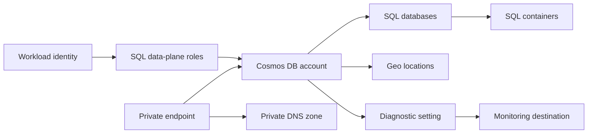

# Azure Cosmos DB Architecture

## Scope

This module owns the Cosmos DB account and optional SQL API database, container, authorization, private endpoint, and monitoring resources. Enterprise network services, keys, identities, monitoring destinations, and application data are caller-owned.

## Ownership Boundary

| Capability | Module-owned | Caller-owned |
| --- | --- | --- |
| Account | Account configuration, consistency, backup, locations and capabilities | Subscription capacity, failover runbook and application retry design |
| SQL API | Optional databases, containers and SQL role resources | Data, schema evolution, indexing performance testing and migrations |
| Network | Private endpoint, DNS association and account firewall rules | VNet, subnets, DNS zones, routing, NSGs and enterprise DNS |
| Identity and keys | Identity attachment, CMK association and configured assignments | Identities, Key Vault, key rotation and external role grants |
| Monitoring | Diagnostic setting | Destination resources, alerts, retention and operational response |

## Network Paths

Public network access is disabled by default. For SQL API accounts, a private endpoint and the `privatelink.documents.azure.com` zone provide private name resolution and connectivity. API variants can require different private-link subresources and DNS zones.

Virtual network rules are service-endpoint firewall rules; they are not private endpoints. IP filters require public network access. Choose one deliberate connectivity model and test resolution and routing from every application network.

## Identity and Authorization

The account has a system-assigned identity by default and can also attach user-assigned identities. This identity supports customer-managed encryption and other account operations; application identities are distinct.

Key-based local authentication is disabled by default. Applications should use Microsoft Entra authentication with Cosmos DB SQL data-plane role assignments scoped to the account, database, or container as narrowly as practical.

## Resiliency and Consistency

Geo locations define failover priority and optional zone redundancy. Multi-region deployment improves resilience but does not replace application retry, idempotency, and regional failover testing.

Consistency is an application contract. Stronger levels can change latency, availability, and regional topology constraints. Coordinate consistency changes with application owners and performance testing.

## Throughput Models

Provisioned manual throughput and autoscale throughput are mutually exclusive at each database or container. Serverless is a distinct account capability: it permits only one region and cannot be combined with provisioned throughput or an account throughput limit.

Set throughput at the database level for shared capacity or at individual containers for isolation. Validate partition-key cardinality and hot-partition risk before production use.

## Backup and Operations

- Continuous backup is the default; verify the required tier, retention, and restore process.
- Monitor throttled requests, normalized RU consumption, availability, replication, storage, and authorization failures.
- Test account failover and application recovery rather than relying only on the configured topology.
- Keep keys and connection strings out of logs, and prefer Entra authentication.
- Treat partition-key and large-scale data migrations as separate operational projects.
