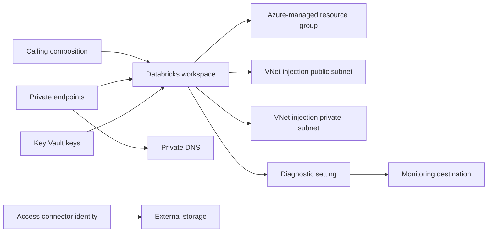

# Azure Databricks Architecture

## Scope

This module owns the Azure Resource Manager workspace boundary and selected supporting resources. Databricks data-plane objects and shared enterprise services remain outside it.

## Ownership Boundary

| Capability | Module-owned | Caller- or platform-owned |
| --- | --- | --- |
| Workspace | ARM workspace and managed resource group relationship | Databricks account, workspace users, clusters, jobs, notebooks and policies |
| Network | Optional private endpoints and their DNS associations | VNet, injection subnets, NSGs, routes, NAT, DNS zones and egress |
| Identity | Optional access connector and configured Azure role assignments | Workload identities, Databricks service principals and data-plane privileges |
| Encryption | Workspace and root DBFS CMK associations | Key Vault, key lifecycle, permissions and rotation governance |
| Monitoring | Azure diagnostic setting | Destinations, queries, alerts, Databricks system tables and application telemetry |

## VNet Injection

VNet injection places workspace compute into two caller-owned subnets conventionally described as public and private. With secure cluster connectivity (`no_public_ip`), neither subnet provides public node addresses; both still require a complete outbound, DNS, NSG, and route design.

The subnet NSG association IDs are passed explicitly because Azure Databricks manages required rule behavior through the workspace configuration. Do not independently change required rules without validating the selected `network_security_group_rules_required` mode.

## Private Workspace Access

VNet injection governs cluster networking. Private endpoints govern access to the workspace control plane:

- `databricks_ui_api` provides private access to the workspace UI and APIs.
- `browser_authentication` supports browser sign-in flows and can be shared or constrained by regional topology.

Private endpoints require the `privatelink.azuredatabricks.net` DNS design and client networks that can route to the endpoint. Coordinate browser authentication at platform scope when several workspaces use the same region.

## Access Connector and Storage

The access connector exposes a managed identity for Unity Catalog and storage firewall scenarios. This module can assign roles to that identity but does not create storage credentials, external locations, catalogs, schemas, or grants inside Databricks.

The workspace managed storage account is created indirectly in the managed resource group. Optional role assignments to it can fail where Azure applies deny assignments; enable them only after reviewing the managed resource group behavior.

## Encryption

Managed disk and managed service customer-managed keys are workspace configuration. Root DBFS encryption is a distinct child resource. All require pre-created keys, supported Premium settings, and correctly sequenced permissions.

Key rotation, disablement, deletion, or permission loss can make the workspace unavailable. Treat key operations as production changes with recovery planning.

## Operations

- Validate control-plane and cluster DNS paths separately.
- Monitor workspace provisioning, private endpoint health, NSG changes, quota, and diagnostic delivery.
- Maintain cluster policies, runtime versions, libraries, jobs, and data-plane access through a dedicated Databricks configuration layer.
- Do not manage resources inside the Azure-created managed resource group unless a documented integration explicitly requires it.
