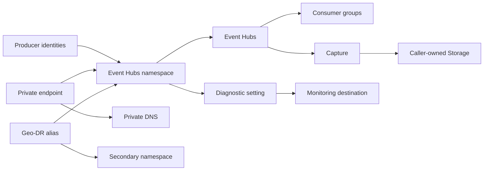

# Azure Event Hubs Architecture

## Scope

This module owns one Event Hubs namespace and optional entities and integrations directly coupled to it. Producers, consumers, checkpoint stores, Capture storage, secondary namespaces, and enterprise networking remain caller-owned.

## Ownership Boundary

| Capability | Module-owned | Caller-owned |
| --- | --- | --- |
| Namespace | Namespace capacity, network, identity and encryption settings | Regional quota, application throughput model and retry behavior |
| Entities | Hubs, consumer groups, optional SAS rules and schema groups | Producers, consumers, checkpoints, schema definitions and payloads |
| Capture | Capture settings on each Event Hub | Storage account/container, permissions, lifecycle and analytics ingestion |
| Private network | Private endpoint and DNS association | VNet, subnet, DNS zone, routing, NSGs and service endpoints |
| Disaster recovery | Alias/pairing configuration | Secondary namespace, failover decision, application endpoints and checkpoint recovery |
| Monitoring | Diagnostic setting | Destinations, alerts, retention and operational response |

## Authentication and Authorization

Local SAS authentication is disabled by default. Prefer Microsoft Entra identities with Data Sender or Data Receiver roles at namespace or entity scope.

Enabling authorization rules turns on credential-based access and exposes sensitive connection strings through Terraform outputs. Protect state and establish rotation and revocation ownership.

## Network Paths

The private endpoint exposes the namespace through the `namespace` private-link subresource. Azure public cloud normally resolves it through `privatelink.servicebus.windows.net`.

Namespace firewall rules and virtual network service endpoints constrain the public endpoint; they do not create private connectivity. Keep public access disabled for a private-only design.

## Capture

Capture asynchronously archives Event Hub partitions to Blob Storage. Storage-SAS mode and managed-identity mode have different permission and credential characteristics. For managed identity, attach the correct identity to the namespace and grant it data-plane access to the destination.

Archive naming, retention, partition count, and downstream compaction affect storage volume and analytics usability.

## Geo-Disaster Recovery

Geo-DR aliases namespace metadata and supports connection endpoint failover. It does not copy event payloads or consumer checkpoints. A production runbook must cover:

- secondary namespace capacity and network parity;
- authorization and identity readiness;
- failover authority and sequencing;
- producer/consumer reconnect behavior;
- checkpoint and downstream data consistency.

## Operations

- Monitor incoming and outgoing messages, throttling, server errors, Capture backlog, authorization failures, and consumer lag.
- Alert on capacity saturation and auto-inflate growth.
- Test private DNS and identity-based send/receive paths from representative networks.
- Rehearse Geo-DR failover without assuming payload replication.
