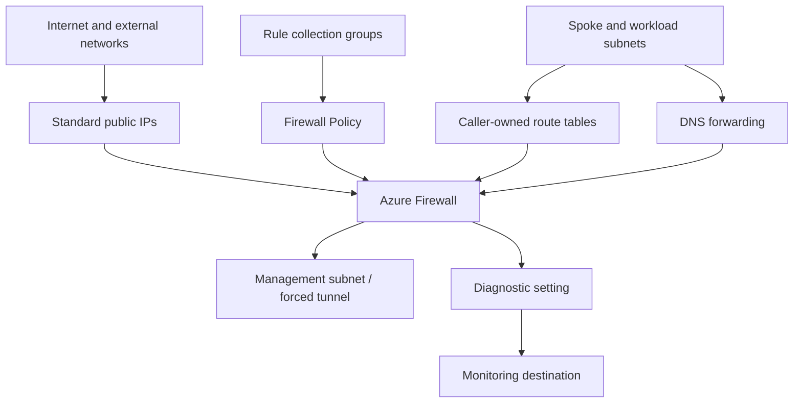

# Azure Firewall Architecture

## Scope

This module owns an Azure Firewall, its optional created public IPs, policy, rule collection groups, diagnostics, and configured RBAC. The network topology and traffic-routing contract remain caller-owned.

## Deployment Modes

### Virtual network

`AZFW_VNet` attaches to the reserved `AzureFirewallSubnet` and normally uses one or more Standard static public IPs. Workload UDRs send selected traffic to the firewall private IP.

### Virtual WAN hub

`AZFW_Hub` attaches to an existing Virtual Hub. Azure manages the hub public IP allocation according to `virtual_hub_public_ip_count`. VNet subnet and module-created public IP inputs do not apply.

## Ownership Boundary

| Capability | Module-owned | Caller-owned |
| --- | --- | --- |
| Firewall | Firewall resource and IP configurations | Hub/spoke topology, address plan, peering and Virtual Hub |
| Policy | Optional policy and rule collection groups | Rule intent, approvals, rollout, exception lifecycle and threat modeling |
| Public IP | Optional created firewall and management IPs | Public DNS, upstream dependencies and inbound publishing design |
| Routing | Firewall next-hop outputs | UDRs, BGP propagation, return routes and asymmetric-routing prevention |
| Identity/TLS | Policy identity attachment and TLS inspection settings | Identity, Key Vault, certificate issuance, permissions and rotation |
| Monitoring | Diagnostic setting | Destination, retention, workbooks, alerts and incident response |

## Policy and Rules

Policy rule collection groups are the preferred rule-management path. Priority establishes evaluation order across groups and collections. Application, network, and NAT rules solve different traffic requirements and should not be collapsed into a single broad allow policy.

Changes can affect every routed workload immediately. Use code review, least privilege, staged rollout, logging, and post-deployment flow validation.

## Forced Tunneling

Providing `AzureFirewallManagementSubnet` adds the management IP configuration required for forced tunneling. The firewall data path can then send default-route traffic toward an on-premises or security next hop while the management plane retains Azure connectivity.

Validate routes for the firewall subnet, management subnet, spokes, gateways, and inspection chain to prevent recursive or asymmetric paths.

## DNS

Firewall Policy DNS proxy is enabled by default. Clients must actually use the firewall private IP as their DNS server for proxy behavior to apply. Upstream DNS servers, private zones, conditional forwarding, and FQDN rule refresh behavior are part of the platform design.

## Premium Inspection

IDPS, TLS inspection, explicit proxy, and policy insights require supported Premium configuration. TLS inspection also requires a user-assigned identity with access to the Key Vault certificate secret.

Inspection changes application trust and privacy boundaries. Coordinate certificates, exclusions, bypass rules, and incident procedures with security owners.

## Operations

- Monitor health, SNAT port utilization, rule hits, denied flows, IDPS events, DNS proxy failures, and diagnostic delivery.
- Maintain an emergency rule rollback process.
- Test north-south and east-west return paths after routing or policy changes.
- Track cost from deployment hours, processed data, public IPs, policy insights, and log ingestion.
