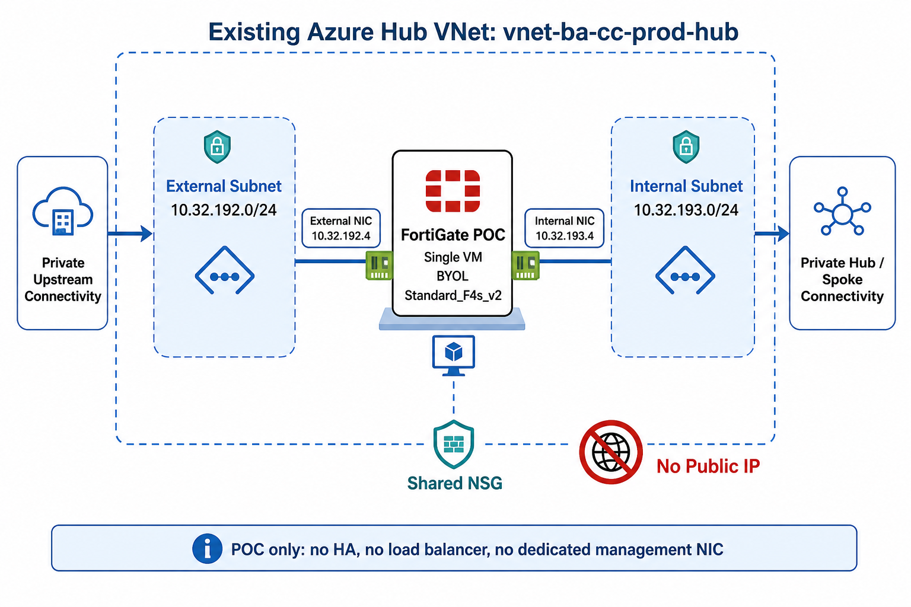
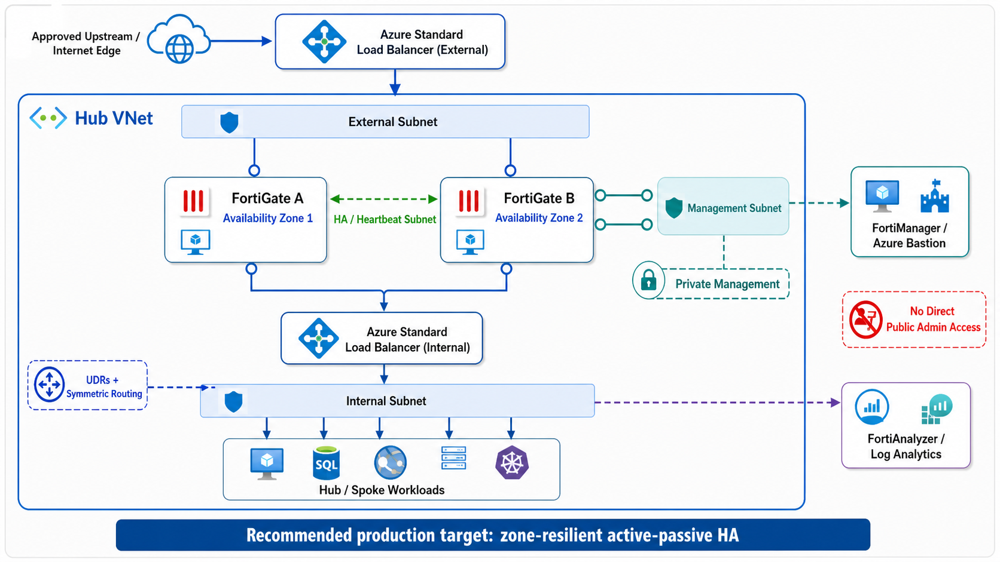

# FortiGate-VM Architecture

## Scope

This module provisions the Azure compute, interface, network security, and optional load-balancing resources used by FortiGate-VM. FortiOS configuration and operational readiness remain separate responsibilities.

## Single Private Instance

The `single` architecture creates one VM and one NIC per enabled interface. A typical isolated deployment uses an external and internal private subnet and no public IP.

Use this pattern for evaluation or workloads whose availability requirements permit a single appliance. It has a single point of failure during host maintenance, upgrades, or appliance failure.

## Active-Passive Pair

The `active-passive` architecture creates two VMs, normally in different availability zones. Optional internal and external Standard Load Balancers distribute traffic to both NIC sets and use FortiGate probe responses to select the active instance.

Dedicated HA and management interfaces can be enabled only for this architecture. Azure provisioning does not configure FortiOS HA synchronization; bootstrap or an external configuration system must establish the pair.

## Network Ownership Modes

| Mode | Inputs | Lifecycle implication |
| --- | --- | --- |
| Existing subnets | Each interface supplies `subnet_id` | Preferred for shared landing zones; network lifecycle remains outside the appliance module. |
| Subnets in existing VNet | `create_subnets = true`, VNet name, interface subnet names and prefixes | Module owns subnet lifecycle but not VNet lifecycle. |
| Dedicated VNet | `create_virtual_network = true`, `create_subnets = true`, address space and interface prefixes | Module owns VNet and subnets; appliance replacement or module removal has a broader network blast radius. |

## Interface and Traffic Model

Every VM receives one NIC per interface enabled for its architecture. Static addressing is recommended for stable routing and load-balancer associations. IP forwarding is enabled by default so FortiGate can route packets.

The `primary` interface affects Azure VM and default-route behavior. Exactly one enabled interface should be primary. UDRs, load balancer HA ports, floating IP, FortiOS routes, NAT, and symmetric return paths must agree.

## Load Balancers

The internal load balancer is private. The external load balancer is also private unless public frontend creation is explicitly enabled. Both can use HA ports and floating IP to pass flows to the active appliance.

Health probes must target a FortiOS listener that accurately represents appliance readiness. A TCP socket or HTTP response that remains healthy during broken forwarding can prevent correct failover.

## Security Boundary

No inbound NSG rule exists by default. Define only the management, HA, probe, and traffic flows required by the design. Public load-balancer opt-in does not automatically add a safe publishing rule or FortiOS policy.

Credentials and bootstrap configuration can enter Terraform state. Prefer a restricted Key Vault, protected remote state, SSH access, and private management networks.

## Operational Responsibilities

The surrounding platform and network teams must own:

- Marketplace licensing and support entitlement;
- FortiOS bootstrap, HA, routing, NAT, security policies and certificates;
- FortiManager/FortiAnalyzer integration;
- backups, patching, image upgrades and rollback;
- route-table and load-balancer coordination;
- monitoring, alerts, probe design and failover testing.

Provisioning success is not proof that the appliance forwards traffic or that failover works. Validate runtime health and end-to-end flows after every material change.
